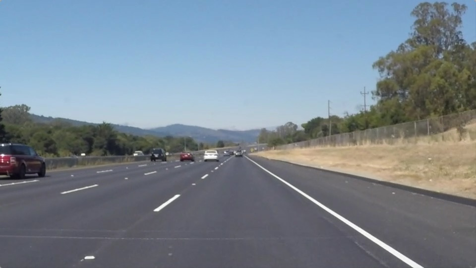
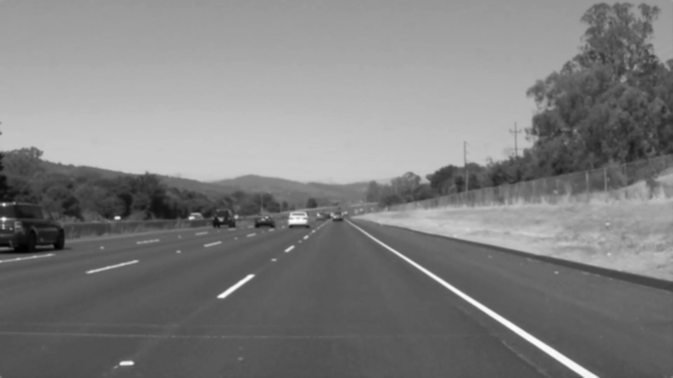

# **Project 1. Finding Lane Lines on the Road** 

## Overview

When we drive, we use our eyes to decide where to go.  The lines on the road that show us where the lanes are act as our constant reference for where to steer the vehicle.  Naturally, one of the first things we would like to do in developing a self-driving car is to automatically detect lane lines using an algorithm.

In this project I detected lane lines in images using Python 3 and OpenCV.

---

## [My Code | Jupiter Notebook](https://github.com/egillanton/Udacity-SDCND/blob/master/1.%20Computer%20Vision%20and%20Deep%20Learning/P1%20Finding%20Lane%20Lines%20on%20the%20Road/P1.ipynb)

---

## Setup (Windows 10)

Step 1. Download: [CarND Term1 Starter Kit](https://github.com/udacity/CarND-Term1-Starter-Kit)

	> git clone https://github.com/udacity/CarND-Term1-Starter-Kit.git
	> cd CarND-Term1-Starter-Kit

Step 2. Rename **meta_windows_patch.yml** to **meta.yml**

	> rename meta_windows_patch.yml meta.yml

Step 3. Install [`miniconda`](http://conda.pydata.org/miniconda.html) on your computer

Step 4. Create a new `conda` [environment](http://conda.pydata.org/docs/using/envs.html) **carnd-term1** using this `CarND-Term1-Starter-Kit/environment.yml`
	
	> conda env create -f environment.yml

Step 5. Download this project

	> cd ..
	> git clone https://github.com/egillanton/Udacity-SDCND.git
	> cd Udacity-SDCND/1.\ Computer\ Vision\ and\ Deep\ Learning/P1\ Finding\ Lane\ Lines\ on\ the\ Road/

Step 6. Activate you **carnd-term1** enviroment
	
	> activate carnd-term1

Step 7. Install required packages

	(carnd-term1) $ conda install numpy pandas matplotlib Pillow
	(carnd-term1) $ pip install opencv-python
	(carnd-term1) $ pip install moviepy

Step 8. Run the envirmoment using Jupyter Notebook

	(carnd-term1) $ jupyter notebook P1.ipynb

Your default browser should pop up.

**Each time you wish to work, activate your `conda` environment**

This should now work. If not, please refer to the link below:

More in dept [CarND Term1 Starter Kit](https://github.com/udacity/CarND-Term1-Starter-Kit/blob/master/README.md) installation instructions!):

---

## My Solution

### 1. My Pipeline
In the first part of the assignment was to create a pipeline function **process_image()** that takes in an image and returns another image that has highlighted lane lines. My pipeline consisted of 5 steps:

#### Original Image

#### Step 1. Convert the image to grayscale.

This is done to  be able to find lines of any color.

##### Grayscale Image

#### Step 2. Blur the grayscaled image using Gaussian  blurring

This is done to suppress noise

##### Blurred Image

#### Step 3. Use Canny Edge Detection on the blurred image

This is done to extract edges within the image

##### Edged Image

#### Step 4. Create a trapezoid mask for the area of interest

This is to narrow down the area that we will be focusing on.

##### Region of Interest Mapped Image

#### Step 5. Apply Hough Transformation on our masked edged image.

This will highlight the lines of interest.

##### Hough Transformed Image

#### Step 6. Mask Hough transformed mask over the original image.

##### Final Image

---

### When Applied on Videos

##### Video 1 Solid White Right

##### Video 2 Solid Yellow Left 

---

### Improve the draw_lines() function
At this point, I was successful with making the pipeline. 

Now I wanted improve it by identify the full extent of the lane and marking it clearly, with a line to run the full length of the visible lane based on the line segments I identified with the Hough Transform.

##### Video 3 Optional Challenge

My solution is based on the already exciting **draw_lines()** function:

	def draw_lines(img, lines, color=[255, 0, 0], thickness=2):
	    for line in lines:
	        for x1,y1,x2,y2 in line:
	            cv2.line(img, (x1, y1), (x2, y2), color, thickness)

My solution consisted of 5 steps:

	def draw_lines2(img, lines, color=[255, 0, 0], thickness=2):
	    threshold =  0.5

	    for line in lines:
	        for x1,y1,x2,y2 in line:

###### Step 1. Get line slope to determine if its left or right side

            len = math.hypot(x2 - x1, y2 - y1)
            
            # Avoid dividing by 0
            if x1 == x2:
                continue
                
            slope = ((y2-y1)/(x2-x1))
            
            # Only accept slopes >= threshold
            if abs(slope) < threshold:
                continue
            
            if (slope >= threshold ): # Then its Right side
                right_lines.append(line[0])
            elif (slope < -threshold ): # Then its Left side
                left_lines.append(line[0])
            
###### Step 2. Get sets of x's and y's, for calculating Extrapolation based
###### [GREAT LINK TO REFERANCE](https://ece.uwaterloo.ca/~dwharder/NumericalAnalysis/06LeastSquares/extrapolation/complete.html)

			# y = m*x + b
            right_m = right_b = 1 
            
            # collect right lines x and y sets for least-squares curve-fitting extrapolation calculations      
            right_lines_x = [x1 for x1, y1, x2, y2 in right_lines] + [x2 for x1, y1, x2, y2 in right_lines]
            right_lines_y = [y1 for x1, y1, x2, y2 in right_lines] + [y2 for x1, y1, x2, y2 in right_lines]

            if right_lines_x:
                right_m, right_b = np.polyfit(right_lines_x, right_lines_y, 1)  # y = m*x + b

            left_m = left_b = 1
            # collect left lines x and y sets for least-squares curve-fitting extrapolation calculating
            left_lines_x = [x1 for x1, y1, x2, y2 in left_lines] + [x2 for x1, y1, x2, y2 in left_lines]
            left_lines_y = [y1 for x1, y1, x2, y2 in left_lines] + [y2 for x1, y1, x2, y2 in left_lines]

            if left_lines_x:
                left_m, left_b = np.polyfit(left_lines_x, left_lines_y, 1) 
            
            y_size = img.shape[0]
            
            y1 = y_size
            y2 = int(y_size*top_y_offset)

            right_x1 = int((y1-right_b)/right_m)
            right_x2 = int((y2-right_b)/right_m)

            left_x1 = int((y1-left_b)/left_m)
            left_x2 = int((y2-left_b)/left_m)

            if right_lines_x:
                cv2.line(img, (right_x1, y1), (right_x2, y2), [255,0,0], 5)
            if left_lines_x:
                cv2.line(img, (left_x1, y1), (left_x2, y2), [255,0,0], 5)

### 2. Potential shortcomings & improvements

Even though it seems that I have completed this project and its requirements, there are several potential shortcomings to keep in mind:
* #### Region of Interest Mapped is a fixed value.

This might result in insufficient images when driving and taking a sharp turn, where the lane lines are more to the right or left.

##### Possible improvements:
Have the values for the x and y offsets  more dynamic by recalculating for each each frame (image). 

---

* #### Array for **right_lines** and **left_lines** are normal array that continuously grow

For longer sequence of images the array will keep growing bigger and the extrapolated lines will not react as well.

##### Possible improvements:
Create a data structure such as a queue to only keep the previous seconds of frames, so old data that is irrelevant don't distract the new data. This will also reduce the exponential space that is required to run the pipeline.

---

* #### Direct control over variables not available

As a user I can not call my function **process_image()** and give it more parameters to control the internal values for the helper functions. 

##### Possible improvements:

Create Global Variables that I can use in my helper functions, and as well in my **process_image()** so I can control more the output of my pipeline.

---

