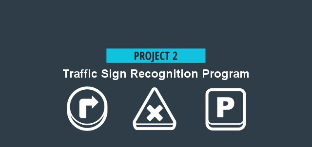

# **Project 2. Build a Traffic Sign Recognition Program** 

## Overview

In this project, I will use what I have learned about deep neural networks and convolutional neural networks to classify traffic signs. I will train and validate a model so it can classify traffic sign images using the [German Traffic Sign Dataset](http://benchmark.ini.rub.de/?section=gtsrb&subsection=dataset). After the model is trained, I will then try out my model on images of German traffic signs that can be found on the web.

We also want I to create a detailed writeup of the project. Check out the [writeup template](https://github.com/udacity/CarND-Traffic-Sign-Classifier-Project/blob/master/writeup_template.md) for this project and use it as a starting point for creating Ir own writeup. The writeup can be either a markdown file or a pdf document.

To meet specifications, the project will require submitting three files: 
* the Ipython notebook with the code
* the code exported as an html file
* a writeup report either as a markdown or pdf file

---

## [My Code | Jupiter Notebook](https://github.com/egillanton/Udacity-SDCND/blob/master/1.%20Computer%20Vision%20and%20Deep%20Learning/P2%20Traffic%20Sign%20Classifier/P2.ipynb)

---

## Setup (Windows 10)

#### Step 1. Download: [CarND Term1 Starter Kit](https://github.com/udacity/CarND-Term1-Starter-Kit)

	> git clone https://github.com/udacity/CarND-Term1-Starter-Kit.git
	> cd CarND-Term1-Starter-Kit

#### Step 2. Rename **meta_windows_patch.yml** to **meta.yml**

	> rename meta_windows_patch.yml meta.yml

#### Step 3. Install [`miniconda`](http://conda.pydata.org/miniconda.html) on Ir computer

#### Step 4. Create a new `conda` [environment](http://conda.pydata.org/docs/using/envs.html) **carnd-term1** using this `CarND-Term1-Starter-Kit/environment.yml`
	
	> conda env create -f environment.yml

#### Step 5. Download this project

	> cd ..
	> git clone https://github.com/egillanton/Udacity-SDCND.git
	> cd 1.\ Computer\ Vision\ and\ Deep\ Learning/P2\ Traffic\ Sign\ Classifier/

#### Step 6. Activate I **carnd-term1** enviroment
	
	> activate carnd-term1

#### Step 7. Install required packages

	(carnd-term1) $ conda install numpy pandas matplotlib Pillow
	(carnd-term1) $ pip install opencv-python
	(carnd-term1) $ pip install moviepy

#### Step 8. Run the envirmoment using Jupyter Notebook

	(carnd-term1) $ jupyter notebook P2.pynb

Ir default browser should pop up.

**Each time I wish to work, activate Ir `conda` environment**

This should now work. If not, please refer to the link below:

More in dept [CarND Term1 Starter Kit](https://github.com/udacity/CarND-Term1-Starter-Kit/blob/master/README.md) installation instructions!):

---